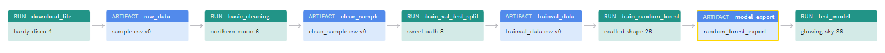

# Build an ML Pipeline for Short-Term Rental Prices in NYC
## Links
- [Project Blog Post]([https://github.com/alturkim/build-ml-pipeline-for-short-term-rental-prices](https://alturkim.github.io/project/blogpost/2023/08/15/MLOPS-P2.html))
- [WandB Project link](https://wandb.ai/alturkim/nyc_airbnb/)

## Introduction
This project builds an end-to-end reproducible Machine Learning pipeline to predict prices of rental properties based on various features. The pipeline is constructed to allow for component to be run independently from each other.

The project employes MLOps tools and best practices. Mainly, the pipeline components are built using [Weights and Biases](https://wandb.ai/) for **Experiement Tracking** and **Artifact Storage and Versioning**, Furthermore, [MLFlow](https://mlflow.org/) is used for **Orchestration** and [Hydra](https://hydra.cc/) for Configuration Management.

__*NOTE*__: The modeling in this project is just a baseline since the focus here is on the MLops aspect of the analysis.

## Usage
To run the pipeline from this Github repo (without cloning), use the following command:
```bash
> mlflow run https://github.com/alturkim/build-ml-pipeline-for-short-term-rental-prices.git -v 1.0.2
```
Alternatively, you can clone the repo locally and use the following commands to interact with the pipeline.

To run the entire pipeline, use the following command:

```bash
>  mlflow run .
```

To run a specific step, e.g. ``basic_cleaning``, use the following command:
```bash
> mlflow run . -P steps=basic_cleaning
```
To run multiple steps together, e.g. the ``download`` and the ``basic_cleaning`` steps, use the following command:
```bash
> mlflow run . -P steps=download,basic_cleaning
```
To override any parameter in the configuration file, use the ``hydra_options`` parameter. The following command set the parameter n_estimators to 10:

```bash
> mlflow run . \
  -P steps=download,basic_cleaning \
  -P hydra_options="modeling.random_forest.n_estimators=10 etl.min_price=50"
```
## Model Testing
Runing the entire pipeline as indicated above is NOT going to execute the testing step that evaluates the model on test data. You need to explicitly specify it as in the steps parameter after promoting the trained model to production with the ``prod`` tag.
```bash
> mlflow run . -P steps=test_regression_model
```

## Data Testing
Deterministic and Non-deterministic Tests are used to verify the fittness of the data.
Deterministic Tests includes, among others, checking the size of the dataset and the range of the dependant variable (price).
Non-deterministic Tests includes verifying the distribution of any new data against the reference dataset that is used to train the initial model using KL divergence.

## Pipeline Visualization
[This link provides an interactive version of this visualization.](https://wandb.ai/alturkim/nyc_airbnb/artifacts/model_export/random_forest_export/v19/lineage)


## License

[License](LICENSE.txt)
